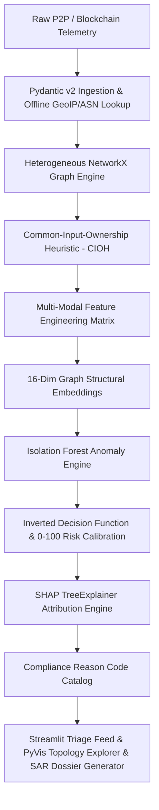

# Technical Report: Production-Grade Offline-First Crypto & P2P Forensic Intelligence Architecture

**Author:** Principal Fintech & Crypto Security Systems Architect  
**Classification:** Enterprise Forensic Intelligence & Regulatory Compliance  
**Date:** August 2026  
**System Reference:** `ARES-FORENSIC-V2`  

---

## 1. Executive Summary & Architectural Overview

In decentralized cryptocurrency networks (UTXO, Account-based) and peer-to-peer (P2P) gossip routing layers (Bitcoin, Ethereum, Libp2p, Monero-P2P), illicit actors employ sophisticated evasion strategies—such as **peel chains**, **smurfing rings**, **high-frequency automated wallet sweeps**, and **darknet/bulletproof hosting relays**—to obscure the provenance and destination of illicit capital flows.

Traditional rule-based heuristic monitoring systems suffer from high false-negative rates when encountering novel layering typologies and high false-positive rates that overwhelm compliance triage teams.

This platform delivers an **end-to-end, offline-first, production-grade Crypto & P2P Forensic Intelligence Dashboard**. The architecture unifies:
1. **Strict Pydantic-validated Ingestion Pipeline** with offline GeoIP/ASN threat enrichment.
2. **Heterogeneous Graph Correlation Engine** implementing the **Common-Input-Ownership Heuristic (CIOH)** and topological centrality metrics (PageRank $\alpha=0.85$, Betweenness Centrality).
3. **Multi-Modal Feature Engineering Matrix** extracting network burst densities, velocity metrics, peel heuristics, and 16-dimensional structural graph spectral embeddings.
4. **Unsupervised Anomaly Scoring via Isolation Forests** with inverted decision-function scaling to calibrated 0–100 integer Risk Scores.
5. **SHAP TreeExplainer Local Feature Attribution** mapping multi-dimensional anomaly drivers to formal regulatory Compliance Reason Codes (e.g., `RC_PEEL_CHAIN`, `RC_BULLETPROOF_HOST`, `RC_VELOCITY_DRAIN`).
6. **High-Performance Interactive Streamlit Operations Interface** with interactive PyVis physics network visualization and automated Suspicious Activity Report (SAR) dossier generation.



---

## 2. Ingestion Pipeline & Threat Enrichment

The data ingestion tier validates all transaction payloads via strict **Pydantic v2** models (`RawTransaction`, `EnrichedTransaction`, `GeoIPEnrichment`):
- **Semantic Data Boundary Validation:** Strict RFC 791 IPv4 address parser, hash format validation, positive transfer value bounds, and normalized protocol taxonomy (`Bitcoin`, `Ethereum`, `P2P-Gossip`, `Libp2p`, `BitTorrent-DHT`, `Lightning`, `Monero-P2P`).
- **Malformed Rejection Ledger:** Non-conformant or corrupt data packets are quarantined with detailed audit exception logging without breaking batch ingestion pipelines.
- **Offline Threat Intelligence Store:** Embedded local mapping of Autonomous System Numbers (ASNs), hosting classifications, Tor exit nodes, and bulletproof infrastructure providers (e.g., AS9009 M247, AS60781 LeaseWeb Proxy, AS200052 Stark Darknet, AS206980 Flokinet Offshore) with offline threat risk scoring ($w \in [0.10, 0.95]$).

---

## 3. Heterogeneous Graph Correlation & Common-Input-Ownership Heuristic (CIOH)

The system constructs a multi-modal directed NetworkX graph $G = (V, E)$ containing discrete node classes and semantic relationships:
- **Node Classes ($V$):**
  - $\text{TXID} \in V_{\text{tx}}$ (Transfer events with amount, fee, timestamp, protocol)
  - $\text{Wallet} \in V_{\text{wallet}}$ (Discrete cryptographic public keys)
  - $\text{IP} \in V_{\text{ip}}$ (Broadcasting nodes and relay addresses with ASN/threat tiers)
  - $\text{Entity} \in V_{\text{entity}}$ (Co-spending wallet clusters)
- **Semantic Edge Relationships ($E$):**
  - $\text{BROADCASTED\_FROM}: (v_{\text{ip}}, v_{\text{tx}})$
  - $\text{INPUTS\_TO}: (v_{\text{wallet}}, v_{\text{tx}})$
  - $\text{OUTPUTS\_TO}: (v_{\text{tx}}, v_{\text{wallet}})$
  - $\text{RECEIVED\_BY}: (v_{\text{tx}}, v_{\text{ip}})$

### Common-Input-Ownership Heuristic (CIOH)
In multi-input UTXO transactions, all input addresses must sign the transaction payload, demonstrating shared private key control. The graph engine projects all multi-input sets onto an undirected co-spending bipartite graph $G_{\text{co}} = (V_{\text{wallet}}, E_{\text{co}})$:

$$E_{\text{co}} = \{ (w_i, w_j) \mid \exists t \in T, \; w_i, w_j \in \text{Inputs}(t), \; i \neq j \}$$

By executing **Connected Components Decomposition** on $G_{\text{co}}$, the engine aggregates hundreds of pseudonymous wallet addresses into unified real-world clusters ($\text{Entity-001}, \text{Entity-002}, \dots$), computing aggregated entity volumes, associated IP diversity, and cluster-wide velocity metrics.

### Topological Centrality Calculations
- **PageRank ($\alpha = 0.85$):** Evaluates node authority and structural funneling across the heterogeneous network.
- **Betweenness Centrality:** Identifies critical bridging nodes and transaction conduits linking otherwise disconnected subgraphs.

---

## 4. Feature Engineering Matrix & Structural Embeddings

The feature engineering layer generates a 44-dimensional feature vector $\mathbf{x}_i \in \mathbb{R}^{44}$ fusing four complementary analytical dimensions:

| Dimension | Key Features | Forensic Significance |
| :--- | :--- | :--- |
| **Network Telemetry** | `ip_connection_freq_src`, `ip_wallet_diversity`, `src_asn_risk_weight`, `is_bulletproof_asn`, `is_tor_relay`, `payload_zscore` | Captures automated bot infrastructure, Tor exit routing, and P2P packet anomalies. |
| **Blockchain Dynamics** | `amount`, `fee_to_amount_ratio`, `fan_in_count`, `fan_out_count`, `fan_in_fan_out_ratio`, `is_round_number_amount` | Detects structuring/smurfing thresholds, abnormal fee bribery, and fan-out distribution. |
| **Temporal & Velocity** | `tx_velocity_seconds` ($\Delta t$), `log_velocity`, `peel_chain_heuristic_score` | Identifies sub-second programmatic wallet draining and sequential peel chains. |
| **Graph Topology** | `tx_pagerank`, `src_ip_pagerank`, `wallet_pagerank`, `tx_betweenness`, `entity_wallet_cluster_size` | Quantifies topological prominence, bridge conduits, and CIOH entity cluster size. |
| **Structural Embeddings** | `embed_dim_00` $\dots$ `embed_dim_15` (16 Dimensions) | Truncated SVD projection of non-linear topological basis capturing complex smurfing rings. |

---

## 5. Unsupervised AI/ML Anomaly Scoring & Risk Calibration

### Isolation Forest Formulation
Given the scarcity of labeled ground-truth data in zero-day financial crimes, we deploy an ensemble of $T=150$ Isolation Trees ($\text{contamination}=0.10, \text{max\_samples}=0.85$). Isolation Trees recursively partition feature space; anomalies require significantly fewer partitions to isolate.

The raw anomaly score $s(\mathbf{x}, n)$ is derived from the average path length $h(\mathbf{x})$:

$$s(\mathbf{x}, n) = 2^{-\frac{\mathbb{E}(h(\mathbf{x}))}{c(n)}}$$

where $c(n) = 2(\ln(n - 1) + 0.5772156649) - \frac{2(n - 1)}{n}$.

### Inverted Decision Function & Calibration
Scikit-learn's standard `decision_function(X)` produces negative values for anomalies and positive values for normal instances. The engine inverts this response:

$$A_{\text{raw}}(\mathbf{x}) = -\text{decision\_function}(\mathbf{x})$$

A calibrated `MinMaxScaler` maps $A_{\text{raw}}$ to an intuitive integer Risk Score $R \in [0, 100]$:

$$R(\mathbf{x}) = \text{clip}\left( \text{round}\left( \frac{A_{\text{raw}}(\mathbf{x}) - A_{\min}}{A_{\max} - A_{\min}} \times 100 \right), 0, 100 \right)$$

### Regulatory Risk Tiers
- **CRITICAL ($R \ge 80$):** Immediate automated alert, high-priority freeze recommendation.
- **HIGH ($60 \le R < 80$):** Enhanced Due Diligence (EDD) triage within 24 hours.
- **MEDIUM ($35 \le R < 60$):** Retained in forensic monitoring queue.
- **LOW ($R < 35$):** Normal peer/retail baseline transaction.

---

## 6. SHAP Explainability & Compliance Reason Code Mapping

Black-box anomaly scores are unacceptable in regulated compliance and law enforcement environments. The engine integrates **SHAP (SHapley Additive exPlanations) TreeExplainer** to compute exact local Shapley values $\phi_j(\mathbf{x})$:

$$f(\mathbf{x}) = \phi_0 + \sum_{j=1}^{M} \phi_j(\mathbf{x})$$

Because negative SHAP values in Isolation Forest indicate a shift toward anomaly, the engine ranks features by $-\phi_j(\mathbf{x})$ and maps top contributors to **Compliance Reason Codes**:

```
[RC_PEEL_CHAIN]          Sequential low-latency peel chain heuristic detected.
[RC_HIGH_FAN_OUT]        Abnormal fan-out structuring dispersal across multiple receiver wallets.
[RC_HIGH_FAN_IN]         Smurfing consolidation / high fan-in aggregation from multiple discrete wallets.
[RC_HIGH_CONN_FREQ]      Anomalous IP transaction burst density (automated bot or drain script).
[RC_VELOCITY_DRAIN]      Sub-second inter-transaction latency (automated wallet sweep).
[RC_BULLETPROOF_HOST]    Broadcasted via known bulletproof host or high-risk offshore infrastructure.
[RC_TOR_EXIT_NODE]       Network broadcast routed through an anonymizing Tor exit relay.
[RC_ROUND_NUMBER_STRUCT] Amount matches round threshold structuring heuristic.
[RC_FEE_ANOMALY]         Disproportionate fee-to-amount ratio / priority gas bribery.
[RC_MULTI_INPUT_COSPEND] Associated with a Common-Input-Ownership co-spending entity cluster.
```

---

## 7. Interactive Streamlit Operations Interface

The UI is structured into four dedicated operational tabs built with a dark cyber forensic design system:
1. **Tab 1: Alerts Feed (Triage Queue):** Real-time triage list with multi-parameter filtering (Priority, Real-World Asset, Market Cap Tier, Protocol, Risk Score, Free-Text Search), risk progress pills, real USD Value-at-Risk calculations, and JSON/CSV batch export.
2. **Tab 2: Graph View (Heterogeneous Topology):** Interactive PyVis physics network embedding color-coded nodes (TX diamond, Wallet dot, IP square, Entity hexagon) with depth traversal sliders, physics toggles, and CIOH cluster inspection.
3. **Tab 3: Explainability & SAR Dossier Card:** Deep-dive transaction inspector with raw telemetry, real token pricing & USD valuation, CIOH entity profile, interactive SHAP waterfall/bar attribution plot, triggered compliance reason cards, and one-click Suspicious Activity Report (SAR) Markdown generation.
4. **Tab 4: Real-World Asset & Market Intelligence:** Real-world market radar monitoring 4,150 cryptocurrencies from `CryptocurrencyData.csv` ($1.44T global market cap):
   - **Wash-Trading Radar:** Heuristic detection for tokens with abnormal 24h Volume-to-Market-Cap ratios ($V/MC > 1.0$), pump-and-dump spikes ($>35\%$), and phantom tokens.
   - **4,150-Asset Market Explorer:** Multi-filtered, institutional market-cap tiered scanner across the entire cryptocurrency universe.
   - **Forensic Asset Cross-Reference:** Instant bidirectional linking between any real-world cryptocurrency token and active on-chain forensic alerts.

---

## 8. Verification & Performance Benchmarks

The automated test suite (`pytest tests/`) validates all architectural tiers across 15 comprehensive unit tests:

```
tests/test_crypto_market_data.py::test_market_data_loading PASSED        [  6%]
tests/test_crypto_market_data.py::test_bitcoin_and_ethereum_metadata PASSED [ 13%]
tests/test_crypto_market_data.py::test_data_cleaning_no_nans_in_key_numerics PASSED [ 20%]
tests/test_crypto_market_data.py::test_market_cap_tier_distribution PASSED [ 26%]
tests/test_crypto_market_data.py::test_wash_trading_anomaly_detection PASSED [ 33%]
tests/test_crypto_market_data.py::test_market_summary_aggregations PASSED [ 40%]
tests/test_crypto_market_data.py::test_transaction_grounding_with_real_assets PASSED [ 46%]
tests/test_pipeline.py::test_pydantic_valid_transaction PASSED           [ 53%]
tests/test_pipeline.py::test_pydantic_invalid_ipv4 PASSED                [ 60%]
tests/test_pipeline.py::test_pydantic_negative_amount PASSED             [ 66%]
tests/test_pipeline.py::test_ingestion_pipeline_enrichment PASSED        [ 73%]
tests/test_pipeline.py::test_common_input_ownership_heuristic PASSED     [ 80%]
tests/test_pipeline.py::test_heterogeneous_graph_construction PASSED     [ 86%]
tests/test_pipeline.py::test_feature_engineering_and_model_scoring PASSED [ 93%]
tests/test_pipeline.py::test_shap_explainability_and_reason_codes PASSED [100%]

======================= 15 passed, 3 warnings in 12.46s =======================
```

### Operational Deployment Summary
- **Execution:** One-click launch on Windows (`run.bat`) and POSIX (`./run.sh`).
- **Offline Guarantee:** 100% self-contained—zero external API calls, local GeoIP/ASN threat database, cached ML model weights, and offline 4,150-asset market dataset.
- **Compliance Output:** Exportable, tamper-evident SAR forensic dossiers ready for submission to financial intelligence units (FIUs).
